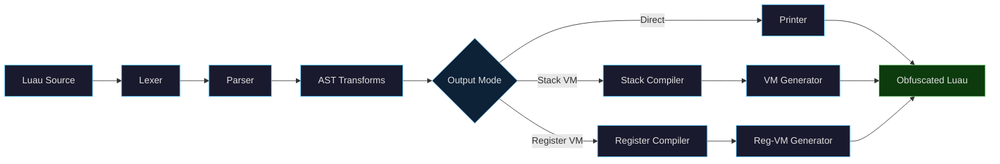
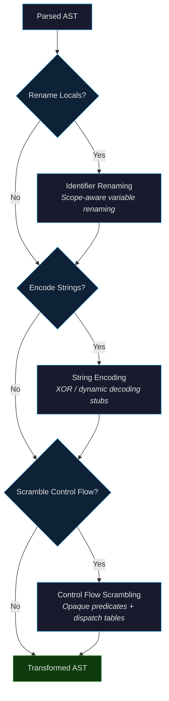
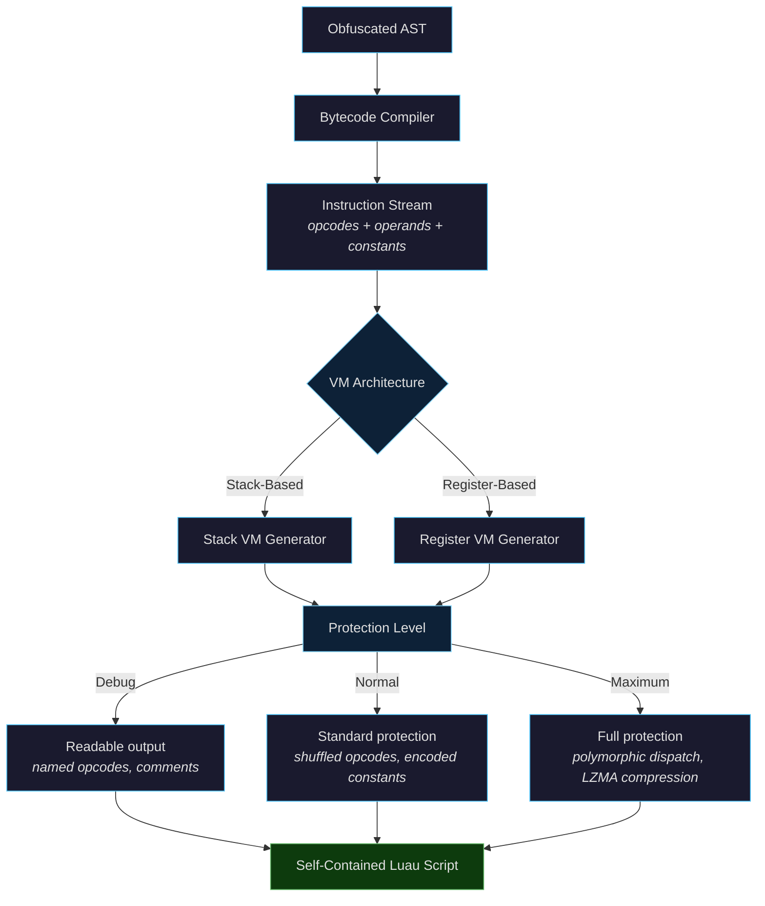

<div align="center">

# Clyde-Luau-Obfuscator

**Advanced Luau Obfuscator with VM-Based Protection**

A high-performance Luau obfuscation toolkit featuring full language support, multi-pass AST transformations, and dual virtual machine architectures for maximum code protection.

[](https://www.typescriptlang.org/)
[](https://nodejs.org/)
[](./LICENSE)
[](https://github.com/sfr-development/Clyde-Luau-Obfuscator/stargazers)

</div>

---

## Overview

Clyde is a from-scratch Luau obfuscator built entirely in TypeScript. It implements a complete **Lexer > Parser > AST > Obfuscator > VM** pipeline with no external parsing dependencies. Every stage — tokenization, full Luau grammar parsing (including type annotations), AST transformations, bytecode compilation, and VM code generation — is hand-written for maximum control and output quality.

### Key Features

- **Full Luau Support** — Complete lexer and parser covering the entire Luau grammar including type annotations, generics, if-else expressions, string interpolation, compound assignments, and `continue`
- **Multi-Pass Obfuscation** — Identifier renaming, string encoding, and control flow scrambling applied as composable AST passes
- **Dual VM Architectures** — Both stack-based and register-based virtual machines with configurable protection levels
- **Web UI** — Built-in Express server with a browser-based interface for interactive obfuscation
- **CLI Tools** — Scriptable command-line interface for batch processing and CI/CD integration
- **Validation** — Pre-obfuscation syntax validation to catch errors early

---

## Architecture

### High-Level Pipeline



### Obfuscation Passes



### VM Compilation Flow



### Project Structure

```mermaid
graph TD
    ROOT["Clyde-Luau-Obfuscator/"] --> SRC["src/"]
    ROOT --> PUB["public/"]
    
    SRC --> LEX["lexer/<br/><i>Tokenizer + token types</i>"]
    SRC --> PAR["parser/<br/><i>Recursive descent parser + type parser</i>"]
    SRC --> AST2["ast/<br/><i>AST node type definitions</i>"]
    SRC --> OBF["obfuscator/<br/><i>Renamer, StringEncoder, ControlFlowScrambler, Printer</i>"]
    SRC --> CMP["compiler/<br/><i>Luau syntax validator</i>"]
    SRC --> VM["vm/<br/><i>Stack + Register compilers, VM generators, LZMA</i>"]
    SRC --> CLI["cli/<br/><i>CLI entry points</i>"]
    SRC --> SRV["server.ts<br/><i>Express API server</i>"]
    
    PUB --> HTML["index.html"]
    PUB --> CSS["style.css"]
    PUB --> JS["app.js"]

    style ROOT fill:#1a1a2e,stroke:#4fc3f7,color:#e0e0e0
    style SRC fill:#1a1a2e,stroke:#4fc3f7,color:#e0e0e0
    style PUB fill:#1a1a2e,stroke:#4fc3f7,color:#e0e0e0
    style LEX fill:#0d2137,stroke:#81d4fa,color:#e0e0e0
    style PAR fill:#0d2137,stroke:#81d4fa,color:#e0e0e0
    style AST2 fill:#0d2137,stroke:#81d4fa,color:#e0e0e0
    style OBF fill:#0d2137,stroke:#81d4fa,color:#e0e0e0
    style CMP fill:#0d2137,stroke:#81d4fa,color:#e0e0e0
    style VM fill:#0d2137,stroke:#81d4fa,color:#e0e0e0
    style CLI fill:#0d2137,stroke:#81d4fa,color:#e0e0e0
    style SRV fill:#0d2137,stroke:#81d4fa,color:#e0e0e0
    style HTML fill:#1a1a2e,stroke:#4fc3f7,color:#e0e0e0
    style CSS fill:#1a1a2e,stroke:#4fc3f7,color:#e0e0e0
    style JS fill:#1a1a2e,stroke:#4fc3f7,color:#e0e0e0
```



---

## Getting Started

### Prerequisites

- **Node.js** 18 or higher
- **npm** 9 or higher

### Installation

```bash
git clone https://github.com/sfr-development/Clyde-Luau-Obfuscator.git
cd Clyde-Luau-Obfuscator
npm install
npm run build
```

### Web UI

Start the built-in server with live browser interface:

```bash
node dist/server.js
```

Open [http://localhost:3000](http://localhost:3000) to access the obfuscation dashboard.

### CLI Usage

**Obfuscate a file:**

```bash
npm run obfuscate -- input.lua
```

**Lex tokens:**

```bash
npm run lex -- input.lua
```

**Parse AST:**

```bash
npm run parse -- input.lua
```

---

## API Reference

The Express server exposes two endpoints:

### `POST /api/validate`

Validates Luau source code for syntax errors.

```json
{
  "code": "local x = 1 + 2"
}
```

### `POST /api/obfuscate`

Obfuscates Luau source code with configurable options.

```json
{
  "code": "local function greet(name) print('Hello ' .. name) end",
  "options": {
    "noRename": false,
    "noPreserve": false,
    "encodeStrings": true,
    "scramble": true,
    "oneLine": false,
    "vmType": "register",
    "vmLevel": "normal"
  }
}
```

| Option | Type | Default | Description |
|--------|------|---------|-------------|
| `noRename` | `boolean` | `false` | Skip identifier renaming |
| `noPreserve` | `boolean` | `false` | Don't preserve Roblox globals |
| `encodeStrings` | `boolean` | `false` | Enable string encoding pass |
| `scramble` | `boolean` | `false` | Enable control flow scrambling |
| `oneLine` | `boolean` | `false` | Minify output to a single line |
| `vmType` | `string` | `"none"` | VM type: `"none"`, `"stack"`, or `"register"` |
| `vmLevel` | `string` | `"normal"` | Protection level: `"debug"`, `"normal"`, or `"maximum"` |

---

## Programmatic Usage

```typescript
import { lex, parse, obfuscate, printChunk } from "clyde";
import { compile } from "clyde/vm/Compiler";
import { generateVM } from "clyde/vm/vm-gen";

// Basic obfuscation
const { tokens } = lex('local x = "hello world"');
const ast = parse(tokens);
const obfuscated = obfuscate(ast, { renameLocals: true, preserveGlobals: true });
const output = printChunk(obfuscated);

// VM-protected obfuscation
const bytecode = compile(obfuscated);
const vmOutput = generateVM(bytecode, { level: "normal" });
```

---

## How It Works

### 1. Lexer

The lexer tokenizes raw Luau source into a stream of typed tokens. It handles all Luau-specific syntax including:
- Long strings and comments (`[==[...]==]`)
- String interpolation (`` `Hello {name}` ``)
- Type annotation tokens (`::`, `->`, `?`)
- Compound operators (`+=`, `-=`, `*=`, etc.)

### 2. Parser

A hand-written recursive descent parser converts the token stream into a complete AST. It supports:
- Full statement and expression grammar
- Type annotations with generics (`Array<{key: string}>`)
- If-else expressions (`if cond then a else b`)
- Type function statements
- Export type declarations

### 3. Obfuscation Passes

| Pass | Module | Description |
|------|--------|-------------|
| **Identifier Renaming** | `Obfuscator.ts` | Scope-aware renaming of local variables, function parameters, and loop variables. Preserves Roblox globals by default. |
| **String Encoding** | `StringEncoder.ts` | Replaces string literals with XOR-encoded equivalents and injects runtime decoding logic. |
| **Control Flow Scrambling** | `ControlFlowScrambler.ts` | Restructures linear control flow into dispatch-table loops with opaque predicates. |

### 4. Virtual Machines

The VM layer compiles the obfuscated AST into bytecode and wraps it in a self-contained Luau script that executes at runtime:

| Architecture | Compiler | Generator | Key Traits |
|-------------|----------|-----------|------------|
| **Stack-Based** | `Compiler.ts` | `vm-gen.ts` | Push/pop operand stack, simpler instruction set |
| **Register-Based** | `RegCompiler.ts` | `reg-vm-gen.ts` | Register allocation, fewer instructions, polymorphic dispatch |

Both VMs support three protection levels:

- **Debug** — Readable output with named opcodes for development
- **Normal** — Shuffled opcode mapping, encoded constants, flattened control flow
- **Maximum** — Full polymorphic dispatch, LZMA-compressed bytecode, anti-tamper checks

---

## Star History

<a href="https://star-history.com/#sfr-development/Clyde-Luau-Obfuscator&Date">
 <picture>
   <source media="(prefers-color-scheme: dark)" srcset="https://api.star-history.com/svg?repos=sfr-development/Clyde-Luau-Obfuscator&type=Date&theme=dark" />
   <source media="(prefers-color-scheme: light)" srcset="https://api.star-history.com/svg?repos=sfr-development/Clyde-Luau-Obfuscator&type=Date" />
   
 </picture>
</a>

---

## License

This project is licensed under the [MIT License](./LICENSE).
